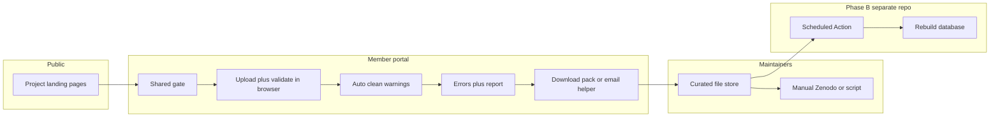

# Project Proposal: Project Website + Data Portal (Simplified v1)

## 1. Goals (this iteration)
- **Public site**: GitHub Pages with normal project information (team, aims, contact, links).
- **Member data portal**: a separate area where network members **upload files** (CSV / Excel, ~1–2 MB). **Human maintainers** receive validated material (and a report) and later put canonical copies on Zenodo manually or with separate tooling—**no automatic Zenodo upload in v1**.
- **Phase B (later repo)**: scheduled **GitHub Action** that ingests submitted data files and **builds/refreshes the analysis database** on a cadence (e.g. monthly or twice yearly).

---

## 2. Architecture Overview

- **All validation and cleaning in v1 runs in the browser** (JavaScript/TypeScript, optional Web Workers for large tables). No R-in-Actions requirement for the portal itself—**dictionaries** (e.g. allowed site names) ship as static JSON with the site or load from a public path in the repo.
- **Hand off to maintainers** is **out-of-band from Zenodo**: email composition, file download, or a tiny third-party form service if you later want server-side mail without running a server.

---

## 3. Access control: “password only members get”

**GitHub Pages is static.** Any secret checked only in JavaScript (or baked into the build) is **obfuscation, not strong security**: a motivated person can read the bundle and recover or bypass the gate.

**Acceptable for v1** if you treat the portal as a **convenience gate** for collaborators (low sensitivity) and accept that **the real safeguard is maintainer review before Zenodo**.

**Stronger upgrades** (when needed): private GitHub Pages + org (enterprise feature), **Cloudflare Access** / similar in front of the portal URL, or a **tiny serverless** endpoint that checks membership—none required to start.

**Practical v1 pattern**: one **shared passphrase** (rotatable) agreed offline; store a **cryptographic hash** in the repo and compare in JS after hashing the user input (never store plaintext in git). Still recoverable if someone reverse-engineers—document this limitation for the consortium.

---

## 4. Validation and auto-cleaning

### 4.1 Error UX
- Block submission until **blocking checks** pass.
- Show **per-row/per-column** issues where possible (e.g. “row 42, column `plot_id`: value `foo` not in dictionary”).
- **Fixable issues** (e.g. trailing/leading whitespace): **apply in memory**, show **warnings**, offer **download of cleaned file** + original retained in UI until user confirms.

### 4.2 Suggested tests (mix of blockers vs warnings)

**Structure & parsing**
- Correct file type (`.csv` / `.xlsx`); readable encoding (UTF-8; flag BOM).
- Exactly **one** primary data table (one sheet for Excel, or named sheet conventions).
- **Required columns** all present; **no duplicate column names**; stable column order optional.
- **Row count** within expected bounds (min/max); optional expected row count for a given submission type.

**Types and ranges**
- Types per column: integer, numeric, date (ISO 8601), boolean, string.
- **Numeric ranges** (e.g. 0–100, strictly positive).
- **Date** parsing and plausible bounds (no year 3000).

**Controlled vocabularies (“dictionary”)**
- **Site / plot / species** IDs: must exist in bundled **lookup tables** (JSON).
- Case policy: **exact match** vs normalized (define once and apply consistently).
- Optional **hierarchical** checks (if site A then only plots 1–n).

**Integrity**
- **Primary key uniqueness** where applicable (e.g. no duplicate `(site, date, subplot)`).
- **Foreign-key-like** rules: every `plot_id` appears in the plot table.
- **Missing data**: disallow empty in required fields; standard missing codes (e.g. `NA`) if you define them.

**Content quality (warnings vs errors)**
- Trailing/leading whitespace → **auto-strip + warning**.
- Empty rows at end of file → strip + warning.
- Detect **duplicate rows** (exact) → error or warning by policy.
- **Outlier flags** (optional): numeric column >n SD from mean → warning only.

**Provenance (lightweight)**
- Optional fields: `collector`, `submission_date`, **semver** or **batch id**; validate format.

You can tune each rule to **BLOCK** vs **WARN** in a single config object so maintainers can tighten policy later without rewriting logic.

---

## 5. Hand off to database maintainers (no auto Zenodo)

**Constraint**: a bare static page cannot reliably **SMTP-send** multipart email with attachments without a **third-party** mail API or **serverless**.

**Practical v1 options** (pick one primary path):

1. **Download pack** (most robust, zero subscription): On success, browser builds a **ZIP** (or two files): cleaned CSV (or Excel) + **validation report** (JSON and/or human-readable Markdown/HTML). User **emails that ZIP** to a consortium address with their normal mail client. The portal can open a **`mailto:`** with **prefilled subject/body** listing checksums and filename—**attachments must be added by the user** (browser `mailto` cannot attach reliably).

2. **Clipboard + instructions**: Copy report summary; user pastes into email alongside manual attachment.

3. **Later enhancement**: **Formspree**, **Getform**, **EmailJS** (free tiers with limits)—form posts file + report to a service that forwards email **requires** accepting an external dependency and (often) file size caps.

**Maintainer workflow**: Curators file submissions in an agreed **inbox** (shared drive, or a **`submissions/` folder in a private repo** fed by hand). That folder becomes the **input convention for Phase B**.

### 5.1 GitHub issue as handoff (prefilled form)
**Without a token, the static portal cannot create an issue via the API**—that would mean embedding a credential in the browser.

**What works well instead**: open the **“New issue”** page in a new tab with **`title` and `body` URL query parameters** (see [GitHub: creating an issue from URL parameters](https://docs.github.com/en/issues/tracking-your-work-with-issues/using-issues/creating-an-issue#creating-an-issue-from-a-url-query)). The portal can build that link after validation so the submitter gets a **draft issue** with checklist text, report summary, and **instructions to attach** the downloaded CSV and JSON report.

**Limits**: total URL length varies by browser (~2k characters is a safe budget for the `body` snippet). Keep the issue body to a **short template**; put the full structured report only in the downloaded **JSON** file. **File attachments** still require the user to drag the downloads into the issue (or paste a link if you later host files elsewhere).

---

## 6. Phase B: separate repository—scheduled database build

- **Own repo** (e.g. `transplant_network_db`) containing:
  - Scripts (`R` or other) that **read canonical data files**, **harmonize schema**, and **emit** the database artifact(s) (SQLite, DuckDB, parquet, or R native—as you prefer).
  - **GitHub Action** on **`schedule:`** (cron) and optionally **`workflow_dispatch`** for manual runs.
- **Inputs**: workflow checks out **this** repo or a **data-only** repo/path; or pulls from a ** tagged release** / **known folder layout** you document.
- **Secrets** (if needed): read-only tokens for private submodule or storage—**only in Actions**, not in Pages.
- **Outputs**: committed artifact, **release attachment**, or build log only—decide based on how consumers fetch the DB.

---

## 7. Implementation milestones

### Phase 1 — Site + portal (this repo)
- GitHub Pages source under **`docs/`** (enable “Deploy from branch” → `/docs`).
- **Landing** (`docs/index.html`): minimal project blurb + link to the portal.
- **Portal** (`docs/data-submission.html`; `portal.html` redirects): shared **SHA-256 passphrase gate** (session only); drag-and-drop **CSV / .xlsx**; client-side **validation + cleaning** (`docs/js/`); optional **`docs/data/dictionary.json`** for allowed values (empty arrays = skip check).
- **Handoff**: download **cleaned CSV** + **`report.json`** (and optional **ZIP**); on-page **copy-paste email instructions** (`MAINTAINER_EMAIL` in config); optional **“Open GitHub issue”** link if `GITHUB_NEW_ISSUE_BASE_URL` is set (`docs/js/config.js`).
- **README**: document default dev password hash (`changeme`), how to regenerate the gate hash, Pages settings, and tightening rules later.

### Phase 2 — Database pipeline (other repo)
- Ingest layout spec (where files live after curation).
- Scheduled Action + manual trigger; reproducible DB build; release or artifact strategy.

---

## 8. Open questions
- **Exact column schema** and which tests are blocking vs warning.
- **Dictionary** ownership: who updates site/plot lists and how often are they published to the portal?
- **Sensitivity**: is shared-password gate enough, or is **institutional data** involved requiring stronger access controls earlier?
- **Where curated files accumulate** before Phase B: private repo folder, Drive, or other—**one** convention avoids scripts guessing.

---

## 9. Retired for v1 (reference only)

Earlier iterations considered **Git-only submission**, **Zenodo tokens in the browser**, and **automatic Zenodo upload from Actions**. Those are **out of scope** for this simplified plan; the notes in git history and prior discussions remain valid if you revisit automation later.
